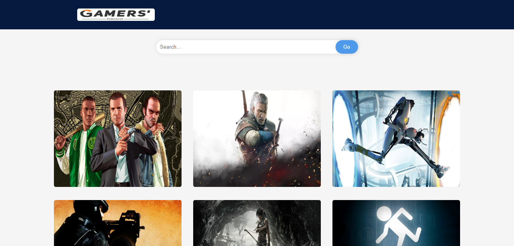
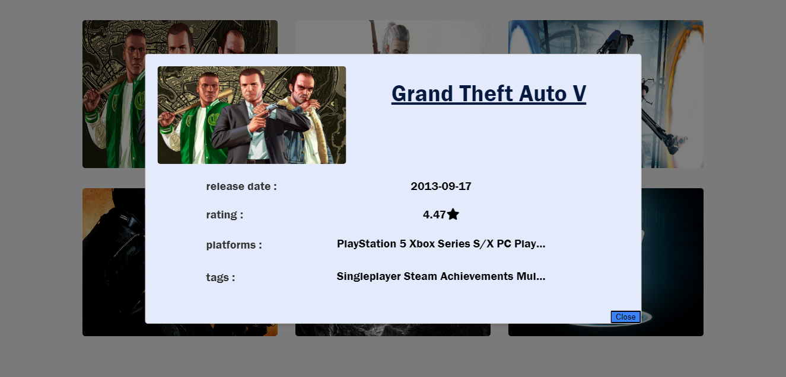

# Python-Flask Game Search App

This project is a simple web application built with Python and Flask, allowing users to search for games using the RAWG Video Games Database API. Users can discover information about various games, including their platforms, stores, release dates, images, ratings, and tags.

## Demo

Check out the live demo: [Game Search App](http://rayeb.pythonanywhere.com/)

## Features

- Search for games by name
- Load more games dynamically
- View details of each game, including platforms, stores, release date, rating, and tags

## Getting Started

To run this project locally, follow these steps:

1. Clone the repository:

    ```bash
    git clone https://github.com/your-username/game-search-app.git
    ```

2. Navigate to the project directory:

    ```bash
    cd game-search-app
    ```

3. Install dependencies:

    ```bash
    pip install -r requirements.txt
    ```

4. Run the Flask application:

    ```bash
    python app.py
    ```

5. Open your web browser and go to [http://127.0.0.1:5000/](http://127.0.0.1:5000/)

## Technologies Used

- Python
- Flask
- HTML
- CSS
- JavaScript
- RAWG Video Games Database API

## API Key

To use the RAWG API, you'll need to obtain an API key from [RAWG API](https://rawg.io/apidocs). Once obtained, replace the placeholder in the code with your actual API key.

# Update this line in app.py
api_key = 'your-api-key-here'
## Screenshots



## Authors

- Your Name
  - [GitHub](https://github.com/your-username)
  - [LinkedIn](https://www.linkedin.com/in/your-linkedin-profile/)
